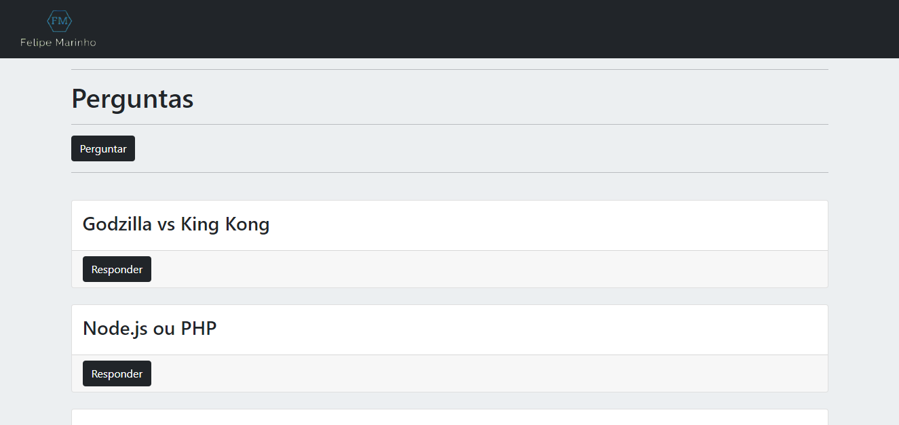
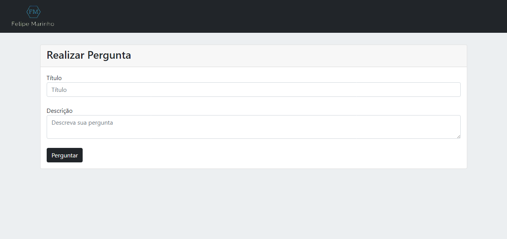
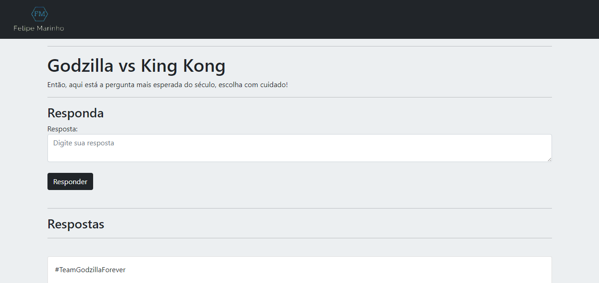

# Guia de Perguntas

 Plataforma de perguntas e respostas criada durante o curso [Formação Node.js](https://www.udemy.com/course/formacao-nodejs/) do [Guia do Programador](https://www.udemy.com/user/guia-do-programador/) afim de aplicar o conhecimento básico adquirido sobre Node.js.

##:construction: Status <br/>
🚀 Concluído

## :toolbox: Tecnologias
* [Node.js](https://nodejs.org/pt-br/)
* [Express](https://expressjs.com/pt-br/)
* [EJS](https://ejs.co)
* [Bootstrap](https://getbootstrap.com)
* [sequelize](https://sequelize.org)
* [mysql](https://www.mysql.com)

## :computer: Features
:white_check_mark: Exibir as perguntas já feitas ordenadas da mais atual para a mais antiga <br/>
:white_check_mark: Exibir respostas ordenadas da mais antiga para a mais atual <br/>
:white_check_mark: Realizar perguntas com título e descrição e armazenar no banco de dados <br/>
:white_check_mark: Realizar resposta das perguntas e armazenas no banco de dados <br/>

## Demonstração
  

## :hammer_and_wrench: Preparando o ambiente
```   
# Clone este repositório:
 $ git clone <https://github.com/felipemdf/Guia_de_Perguntas.git>

# Acesse a pasta do projeto no terminal/cmd 
 $ cd Guia_de_Perguntas-main

#Inicie o gerenciador de pacotes npm: 
 $ npm install

# Instale o pacote Express para criação das rotas: <br/>
 $ npm install express --save

# Instale o pacote EJS responsavel pela view engine: <br/>
 $ npm install ejs 

# Instale a ferrament ORM Sequelize: 
 $ npm install --save sequelize
 
# Instale o Bootstrap:
 $ npm install bootstrap@next
 
# Instale o pacote de dependências do mySQL:
 $ npm install --save mysql2

# Opcionalmente pode-se instalar o Nodemon para monitorar e atualizar automaticamente o servidor:
 $ npm install -g nodemon
 
# Execute a aplicação
 $ nodemon index.js

# O servidor inciará na porta:8080 - acesse <http://localhost:8080> 
```
